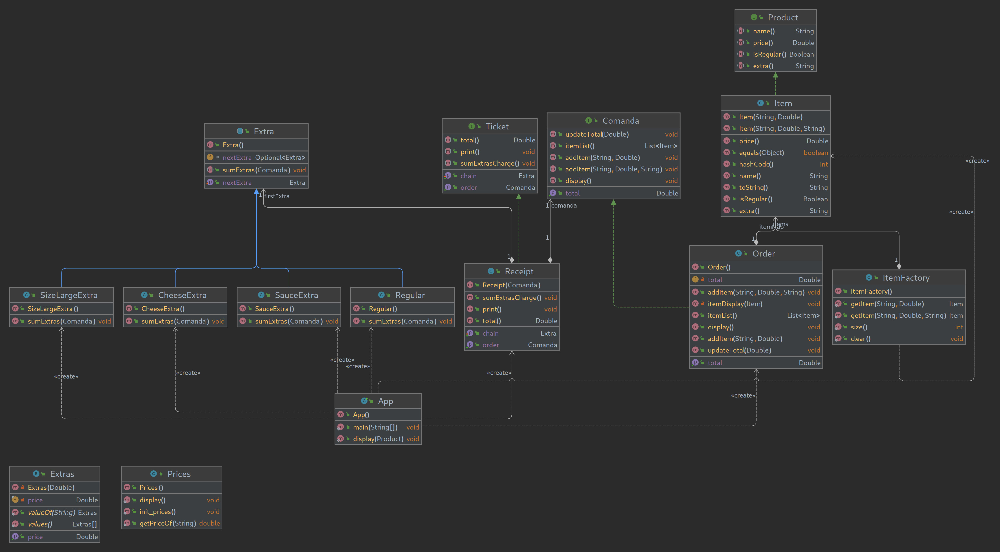

# Galley Grub

## VI. Examen Programación DAW Dual
Calamardo necesita tu ayuda para crear un programa que procese los pedidos del Krusty Krab.  
Crea el programa con la ayuda del diagrama UML.  

Squidward needs your help to create a program to process the orders of the Krusty Krab.  
Create the program with the help of the UML diagram.  

## Key-Concepts :dart: 
- Factory Pattern
- Chain of Responsibility
- TDD
- Abstract Classes

## UML
